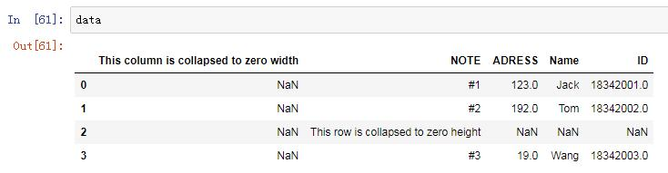
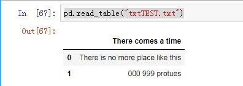

# Lab 3    Pandas数据分析

### 实验目的：
学习Pandas数据分析基础，统计描述及数据可视化
### 实验简介：
Pandas数据导入，数据变换处理，统计汇总描述，假设检验，可视化
### 实验环境：
Software：Jupyter Notebook （5.7.3）  
OS：Windows7
Hardware：Macbook Pro i5 8G/512G

### 实验步骤：
本实验主要按照教程中的指示，在notebook环境下实操了各种操作及函数调用。代码及运行结果请移步我的github上：
https://github.com/Lorisyy/MachineLearning2019/blob/master/Lab03TestAndExample.ipynb

作为作业还学习了pandas扩展库中四种处理NaN数据的函数，还有打开excel文件与txt文件的方式。
作业：
# 一、使用四种NaN数据处理
## 0.构建dataframe（Including NaN）：
```
import pandas as pd
import numpy as np
#构建df模式的数据块
df = pd.DataFrame(np.random.randn(10,6))
// Make a few areas have NaN values
df.iloc[1:3,1] = np.nan
df.iloc[5,3] = np.nan
df.iloc[7:9,5] = np.nan
```
[You can see it also in my code:18342107_宿永烨_lab3.ipynb](https://github.com/Lorisyy/MachineLearning2019/blob/master/18342107_%E5%AE%BF%E6%B0%B8%E7%83%A8_lab3.ipynb )
1.reindex

reindex is mainly to rebuild a dataframe that is new from the former dataframe.(按照原有的列index，使用reindex()方法可以对指定轴上的索引进行改变/增加/删除操作，这将返回原始数据的一个拷贝。


#### 参数：
mapper, index, columns : 映射的规则。

axis：指定轴，可以是轴名称（'index'，'columns'）或数字（0,1），默认为index。

copy：布尔值，默认为True，复制底层数据。

inplace：布尔值，默认为False。指定是否返回新的DataFrame。如果为True，则在原df上修改，返回值为None。

level：int或level name，默认为None。如果是MultiIndex，只重命名指定级别的标签。

#### 返回值：
DataFrame


代码块见notebool文件，运行结果：
df：Show the default dataframe in output:

 0	1	2	3	4	5
0	0.603562	0.229949	-1.023600	1.540919	-0.200039	-0.396599
1	0.259773	NaN	-0.180162	-0.720527	-0.728893	1.720524
2	0.472371	NaN	-2.105695	-1.077718	0.767637	0.635908
3	0.213458	-0.255880	1.013059	1.337962	1.928138	-0.202440
4	-0.891716	0.156471	-0.586631	0.385864	0.541776	-0.641860
5	0.004100	-0.836496	0.053097	NaN	0.014818	-0.024102
6	0.648770	-1.420443	1.349611	-0.081654	-0.060672	1.051232
7	-0.977081	1.424746	-0.062561	-0.204701	0.357000	NaN
8	-0.746888	0.506184	1.148407	0.046974	0.796148	NaN
9	0.949596	0.340891	-1.790913	0.129086	-0.226821	1.509599

 ```
df.reindex(index = range(6))  # 在该df中的作用是删除6~10行 
df.reindex(index = range(16)) #将index扩展到0~15 若扩展位置无数据匹配则自动填充为NaN
df.reindex(index = range(6)) #删除6~10行，这里reindex的对象是0~5行，则未被reindex的行的数据视为自动抹去。
```
### 2.isnull
isnull():利用pandas数据分析是，判断缺失值一般采用 isnull()，然而生成的却是所有数据的true／false矩阵，对于庞大的数据dataframe，很难一眼看出来哪个数据缺失，一共有多少个缺失数据，缺失数据的位置。
简而言之，就是对你的dataframe遍历过后，哪一个不是NaN其bool值就是1，反之则为0.¶

#### 1）df.isnull()
 将数据df进行布尔填充 Boolean Matrix where 0(False) represents NOT NaN,1 represents NaN.得到的表如下：
	  0	      1	      2  	 3     	 4	     5
0	False	False	False	False	False	False
1	False	True	    False	False	False	False
2	False	True	    False	False	False	False
3	False	False	False	False	False	False
4	False	False	False	False	False	False
5	False	False	False	True	    False	False
6	False	False	False	False	False	False
7	False	False	False	False	False	True
8	False	False	False	False	False	True
9	False	False	False	False	False	False

#### 2）df.isnull().any()   
#判断哪些”列”存在缺失值，0与1代表着：无缺失值、有缺失值。得到的表如下：
0    False
1     True
2    False
3     True
4    False
5     True
dtype: bool

#### 3）其他尝试：
我尝试着将df.isnull().any()的any()改成every()，想看看是不是OR与AND的差别，但是没有这种函数。这种every()实际存在意义也不是很大，毕竟NaN不是有效真实数据。

#### 4）df[df.isnull().values==True] # 这样做是要筛选出所有含有NaN的列并且显示出来。得到的表如下：这种调用的目的是找到所有含有NaN的数据行。
0	         1	     2	        3	        4	        5
1	0.962617 	NaN	     0.293691	-0.291726	-0.451866	1.622139
2	0.170066 	NaN      1.125507	0.466408	    -1.798362	-1.712312
5	-1.814167	0.433729 	0.592038	   NaN	     0.334144	2.004952
7	0.029814	    0.869257	  0.576349	-0.493430	0.103334	     NaN
8	0.372356	   -1.155802  -0.799002	0.360866	     0.433117		NaN
### 3.dropna
dropna() that is a function that will drop NaN data regarding them as invalid data.
Dropna() 的优势在于能够剔除含有无效数据的行，但是缺点是过于简单粗暴，在实际应用中不一定能够达到理想的效果。
#### 1）
`df.dropna(how='any') #直接对NaN进行丢弃，丢弃后结果如下：`
0	       1	    2	       3	        4      	5
0	-0.581857	0.564325	-0.349324	-0.037061	1.022179	 -0.284489
3	0.438708 	-1.304564 -1.110266	-0.379719	1.144986	  0.398184
4	-1.209766	0.273618  1.098503	0.498348	   -0.483114	  -1.205215
6	1.353599 	0.418583	-1.064899	-0.698359	-0.594659	2.128159
9	-0.152563	-0.523514	0.610765	0.423978	   -2.541131	 0.558537

### 4.fillna()
This is simple as dropna , in dropna you drop NaN rows,and in this function called fillna is to fill the NaN part of df

`df.fillna(9090) #This is to fill the NaN with the number you give.`
将NaN替换为（浮点数）9090.替换后结果如下：

0	1	2	3	4	5
0	0.186988	0.727406	1.612304	-1.140764	0.210463	-0.285195
1	0.987385	9090.000000	0.681829	0.945436	-1.526959	-0.056138
2	-0.296433	9090.000000	1.739818	0.658659	-0.421553	-1.285619
3	-0.780199	-0.459983	-0.442935	-1.063819	-0.259574	0.630261
4	0.369417	0.361991	0.785512	-0.548535	0.097247	0.333522
5	1.113041	0.435624	-1.939972	9090.000000	-1.330836	1.607178
6	0.218998	1.592323	0.413327	-1.190775	1.090635	0.619801
7	1.628683	1.623181	-1.022958	1.837558	-0.256136	9090.000000
8	1.305302	-0.222067	0.792818	1.407149	0.249114	9090.000000
9	0.444012	2.249015	-0.214677	1.019814	3.073255	-0.913773

## 二、读取
### 1、read_excel读取excel文件
`pandas.read_excel（io，sheet_name = 0，header = 0，names = None，index_col = None，usecols = None，squeeze = False,dtype = None, ...）`
（）内的是read_excel函数的参数：

io：字符串，文件的路径对象。
sheet_name：None、string、int、字符串列表或整数列表，默认为0。字符串用于工作表名称,整数用于零索引工作表位置,字符串列表或整数列表用于请求多个工作表，为None时获取所有工作表。
CollapsedHide.xls放在和ipynb文件不同的目录时，读取成功概率不如在同一文件夹下高。

注意：删除了A行，观察其读取。
```
basestation ="CollapsedHide.xls"
data = pd.read_excel(basestation)
print (data)
```
输出结果：This column is collapsed to zero width  \
0                                     NaN   
1                                     NaN   
2                                     NaN   
3                                     NaN   

                                   NOTE  ADRESS  Name          ID  
0                                    #1   123.0  Jack  18342001.0  
1                                    #2   192.0   Tom  18342002.0  
2  This row is collapsed to zero height     NaN   NaN         NaN  
3                                    #3    19.0  Wang  18342003.0  
仍然读取A行，在空行按照NaN返回数据。

代码data输出结果：



转置T：data.T(类似于矩阵转置)


### 2.read_table 函数:
功能: 从文件、url、文件型对象中加载带分隔符的数据，默认为'\t'。（read_csv默认分隔符是逗号）

可以通过制定sep 参数来修改默认分隔符。

读取没有标题的文件时，默认为第一行作为列标题，列索引（即行的标题）为0开始的数字，设置header=None, 则列索引也变为0开始的数字，通过names=['a','b','c']可以自己设置列标题。

通过index_col可以设置列索引，默认使用0开始的整数为列索引。

`pd.read_table("txtTEST.txt")`

OUTPUT:

